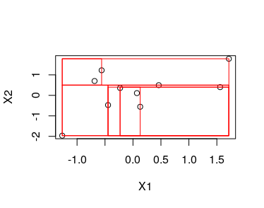

```{r setup, include=FALSE}
knitr::opts_chunk$set(echo = TRUE)
```

## Methods for the recursive partitioning tree

* In this lab we will write methods for the 
tree, nodes and regions output by the `recpart()` function in 
the week 4 exercises. See the week 4 exercises document
for the function definition and data structures.

1. Write a print method, `print.region()`, for
a region data structure. Print whatever you find
interesting or relevant about a region.

2. Write region-plotting methods `plot_regions.tree()`
for trees and `plot_regions.node()` for nodes. These
functions should
plot the covariate data and regions obtained by 
recursive partitioning. You should assume that 
there are exactly 2 covariates.
    * `plot_regions.tree()` should take a tree 
    as input, do a scatterplot of
    the covariate data in the tree (`tree$data$x`) 
    and then call `plot_regions.node()` on each
    of the child nodes of the tree.
    * `plot_regions.node()` should take a node as input.
    If the node is NULL, the function should just 
    return without doing anything. If node is not NULL,
    the function should (i) use `lines()` to draw a box
    on the scatterplot with vertices given by
    the coordinates matrix in the node's data and 
    then (ii) call itself on the input node's two child nodes.
    Thus, `plot_regions.node()` recursively traverses 
    the tree, plotting the regions of the partition.

Note: unlike `plot()` there is no generic `plot_regions()`
so you will have to call `plot_regions.tree()` 
and `plot_regions.node()` explicitly.
Later we will see how to "register" methods and
define generics.

3. Test your functions on the following test dataset.
The plot generated by `plot_regions.tree()` should 
look like the figure shown below, though you are
free to choose your own colour for the lines.

```{r}
# Test:
set.seed(123); n <- 10
x <- data.frame(x1=rnorm(n),x2=rnorm(n))
y <- rnorm(n)
# mytree <- recpart(x,y)
# plot_regions.tree(mytree)
```



