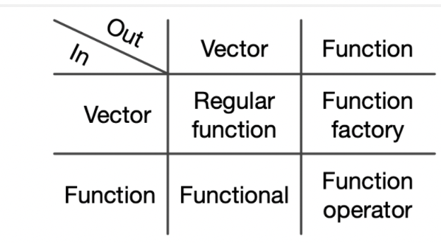

## Digging deeper into functions

* Reading: Text, sections 6.4-6.8
* Topics:
    * more on scoping (finding objects)
    * lazy evaluation and variable arguments with ...
    * exiting a function
    * prefix, infix, replacement and special function forms


# Scoping

## Lexical scoping in R

* We have already touched on the essence of scoping in R: When
a computation needs an object we start by looking in 
the current environment, and then search successive 
enclosing environments.
* More formally R has four rules:
    * Name masking
    * Functions versus variables
    * A fresh start
    * Dynamic lookup
    
## Name masking

* A consequence of the search order for objects is that
names defined *inside* a function mask names defined *outside*.

\scriptsize

```{r}
x <- y <- 200
z <- 30 # defined in global environment
f <- function() { # f's env enclosed by global
  x <- 100 # defined in f's environment
  y <- 20
  g <- function() { #g's env enclosed by f's
    x <- 10 # defined in g's environment
    c(x,y,z)
  }
  g()
}
f()
```

## Functions *vs* names

* R does the "right thing" when you (stupidly) use the same 
name for a function and variable.

\scriptsize

```{r}
g09 <- function(x) x + 100
g10 <- function() {
  g09 <- 10
  g09(g09)
}
g10()
```
## Each function call gets a new environment

* As we saw in lecture 3, function calls create an environment.
On exit, this environment is (typically) unbound and will 
disappear.

\scriptsize

```{r}
x <- 100
f <- function(){
  print(environment())
  x <- x+1
  x
}
f()
f()
```

## Dynamic lookup

* Be aware that functions only look for objects when run (dynamic lookup), 
not when created (static lookup). 
* If a function gets an object from an enclosing environment,
it will return different results whenever the object in 
the enclosing environment changes.
    * This may be what you intend, but it's also a common source
    of errors. What if I meant to define y in f() but forgot:

\scriptsize

```{r}
y <- 100
f <- function(x) {
  x + y
}
f(1)
y <- 200
f(1) 
```

* consider adding `rm(list=ls())` to the start of your scripts

# Lazy evaluation and ...

## Lazy evaluation

* Function arguments are only evaluated when needed.
    * The text describes how lazy evaluation is implemented
    (Section 6.5), but we will not discuss the details.

\small

```{r}
f<-function(xx,yy) {
  xx
}
f(1) # no value for yy, but OK since yy not used
try(f(yy=1)) # xx is needed
```


## Variable arguments with ...

* The special function argument `...` (dot-dot-dot) allows
a function to take any number of arguments.
* A typical use is to pass these to another function, as in 
the following example.

\small

```{r,fig.height=4}
myplot <- function(x,...) {
  plot(x,x^2,...) # pass any args not named x to plot
}
myplot((-5:5),col="red",pch=16)
```

# Exiting a function

## Exiting a function

* Functions can exit explicitly with `return()`
or implicitly, where the last expression in the
function is its return value
* When a function returns, explicitly or implicitly, 
the default is to print the return value. 
    * You can suppress this with `invisible()`.

\small

```{r}
ff <- function(x) { x }
ff(1)
ff_invis <- function(x) { invisible(x) }
ff_invis(1) # but x <- ff_invis(1) same as x <- ff(1)
```

## Signalling conditions

* Functions can signal error, warning or message
conditions with `stop()`, `warning()` and `message()`,
respectively.
    * `stop()` stops execution, `warning()`
    and `message()` don't
* These signals can be "handled" by ignoring them
    * ignore errors with `try()`
    * ignore warnings with `suppressWarnings()`
    * ignore messages with `suppressMessages()`
* or implementing a custom handler that over-rides
the default behaviour of a condition
    * see Chapter 8 of the text if you are interested in 
    learning more about handling conditions 
* We restrict attention to (i) signalling and (ii) 
cleaning up any changes to the R session before exiting.


## `stop()`

* If your function encounters an error, use `stop()` 
to stop and print an error message, also called
"throwing" an error.

\small

```{r}
centre <- function(x,method) {
  switch(method,mean=mean(x),median=median(x),
         stop("method ",method," not implemented"))
}
try(centre(1:10,"mymean"))
```


## `warning()` 

* If you suspect an error but can proceed without
stopping, throw a `warning()` instead.

\small

```{r}
centre <- function(x,method) {
  switch(method,mean=mean(x),median=median(x),
         {warning("\nmethod ",method,
                  " not implemented, using mean\n"); 
           mean(x)})
}
centre(1:10,"mymean")
```

## `message()`

* If you don't think the condition warrants a warning,
you can issue a message.

```{r}
centre <- function(x,method) {
  switch(method,mean=mean(x),median=median(x),
         {message("\nmethod ",method,
                  " not implemented, using mean\n"); 
           mean(x)})
}
centre(1:10,"mymean")
```


## Cleaning up with exit handlers

* An R session has a "global state" of options and
parameters that control default behaviour.
    * type `options()` or `par()` to see some of these
* If your function temporarily modifies the global state, 
you can use an exit handler to re-set, even if your
function stops.
    * Use `add=TRUE` to add more than one handler.
    

\small

```{r}
rplot <- function(y,x){
  opar <- par(mfrow=c(2,2))
  on.exit(par(opar),add=TRUE) 
  plot(lm(y~x)) #could throw an error
}
y <- rnorm(100); x <- rnorm(10) # different length
try(rplot(y,x)) # Fails, but re-sets par mfrow
```

# Function forms

## Function forms

* We have been writing "prefix" functions, with a function
name followed by arguments.
* Other forms are "infix", "replacement" and "special".
* We will cover each form very briefly; see the text,
section 6.8 for more details.

## Infix functions

* An infix function has two arguments and
is called by putting the name
between arguments, as in `x+y`.
    * `x+y` calls `+` as ``` `+`(x,y)```
    * `+` and `-` are special infix functions that
    can be called with only one argument
    * You can define your own infix function by 
    enclosing the function name in `%`.

\small

```{r}
`%-%` <- function(set1,set2){
  setdiff(set1,set2)
}
s1 <- 1:10; s2 <- 4:6
s1 %-% s2 # same as `%-%`(s1,s2)
```

## Replacement functions

* Replacement functions are called to change values.
    * For example, change values of attributes of objects
* Must have arguments `x` and `value`, and must return the modified object.
* They are made to look like prefix functions, and 
may have prefix counterparts.

\footnotesize

```{r}
x <- c(a=1,b=2)
names(x)
names(x) <- c("aa","bb")
x
x <- `names<-`(x,c("aaa","bbb"))
x
```

##

* You can write your own relacement functions if 
you end the function name with `<-` 

\small

```{r}
`st360names<-` <- function(x,value){
  names(x) <- paste0(value,"360",names(x))
  x
}
st360names(x) <- c("a","b")
x
```

## Special functions

* Examples: subset `[` and extract `[[`, control flow
`if`, `for`,etc. 
* Key point: These are functions,
and it is sometimes useful to know their names so
that we can get help or
use them like any other prefix function.

\small

```{r}
dd <- data.frame(x=1:2,y=3:4)
`[[`(dd,1) # compare to dd[[1]]
dd <- `[[<-`(dd,1,value=5:6) #cf dd[[1]] <- 5:6
dd
```

##

* It can be useful to know functions by name so that
we can call them in `lapply`-like functions.

\small

```{r}
sapply(dd,`[[<-`,2,value=10)
```

# Functional Programming Basics

## Functional programming languages

* In a functional language functions are data structures. 
    * Can assign them to variables, pass them as arguments to other
    functions and return them from other functions.
    * This is true of R functions, and is what we'll be focusing on.
    
* Many functional languages also require functions to be "pure".
    * Function output should only depend on the input, and the function
    should not have any side-effects.
    * We can see from our brief discussion of scoping that R functions
    can use global variables, and we know they have side-effects like
    generating plots.
    
## Functional style

* We will say that functional programming *style* means 
a top-down approach that breaks big problems into smaller pieces
that we solve with small, easy (easier) to understand  functions.
* This is the way we are approaching our implementation of MARS.
* Functional languages support this style with "higher-order"
functions that take other functions as input .
    * The higher-order function is part of the "big problem", 
    and its input is the "small function".

## Functionals

* You have already seen higher-order functions in Stat 260: The 
`map` family of functions from the `purrr` package, or 
`lapply()` from base R. 
* The text calls these functionals and they are discussed in Chapter 9.
* You have already studied the `map` functions, so our discussion here 
will be brief, with an emphasis on parallelization:
    * Not only can we break a computation into pieces, but we can have 
    the pieces computed on different cores of a computer or nodes 
    of a compute cluster.

## Map-like functions such as `lapply()`

* Take a vector and function as input and return
a list (or some simplification) whose elements are the function applied to each vector element.
    * We are mapping (in math sense) the vector elements $x$ to $f(x)$.
* Basically a for loop over the input vector, calling the input
function at each iteration.

\scriptsize

```{r}
simple_map <- function(x, f, ...) { # text, Section 9.2
  out <- vector("list", length(x))
  for (i in seq_along(x)) {
    out[[i]] <- f(x[[i]], ...)
  }
  out
}
```

## Examples with `lapply()`

\scriptsize

```{r}
rfun <- function(seed,n) { set.seed(seed); return(rnorm(n))}
dat <- lapply(1:10,rfun,n=1e7) # specify non-vectorized arg by name
mfun <- function(x) { return(mean(quantile(x,probs=c(.25,.75)))) }
system.time( unlist(lapply(dat,mfun)) ) # Look at elapsed
```

## Parallel execution with `mclapply()` 

* `mclapply()` is the multi-core version of `lapply()`; i.e., function 
calls are done on separate cores.

\scriptsize

```{r}
library(parallel) # comes with R
ncores <- detectCores() ; cat("number of cores=",ncores,"\n")
system.time({ unlist(mclapply(dat,mfun,mc.cores=ncores)) })
```

## Another example


\scriptsize

```{r}
dat2 <- lapply(1:10,rfun,n=1e5) 
mfun2 <- function(x) { return(data.frame(sum=sum(x),n=length(x))) }
sumdat <- lapply(dat2,mfun2)
```

## Reduce-like functions

* Reduce functions successively combine vector elements. 
    * Can use them to assemble output of a map-like function.
    * When implemented to parallelize over multiple computers, 
    this is the MapReduce programming model you hear about for 
    "big data".

* Reducers combine with a loop:

\scriptsize

```{r}
simple_reduce <- function(x, f) { # Text section 9.5
  out <- x[[1]] 
  for (i in seq(2, length(x))) {
    out <- f(out, x[[i]])
  }
  out
}
```

## Example reduce

\scriptsize

```{r}
allres <- simple_reduce(sumdat,rbind)
allres
sum(allres$sum)/sum(allres$n) # mean
```


## Further reading on parallel computing

* For parallel computing on a cluster, see the `doParallel` and
`foreach` packages (canonical link to doParallel vignette currently broken):

http://users.iems.northwestern.edu/~nelsonb/Masterclass/gettingstartedParallel.pdf

## Other higher-order functions

* Other chapters discuss function factories (Chapter 10) and function
operators (Chapter 11).
* These are used less and will not be discussed.

{width=60%}