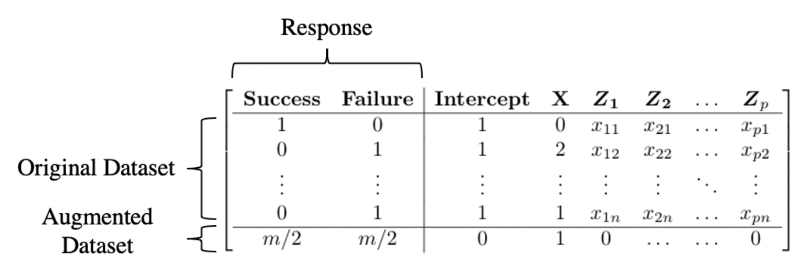

```{r setup, include=FALSE}
knitr::opts_chunk$set(echo = TRUE,warning=FALSE,message=FALSE)
```


## Motivation: GWAS for binary outcomes

* Genome-wide association study (GWAS) analyses typically consist of estimating and testing associations between a disease trait (phenotype) and 
genetic markers called single nucleotide variants (SNVs).

{width=90%}

## Maximum likelihood inference of SNV effects

* The maximum likelihood estimator (MLE) is the maximizer of the 
**likelihood**, the probability of the data as a function of the regression  parameters.
* Let $Y_i=1$ if subject $i$ has the disease and 
0 if not and $X_i$ take value 0, 1 or 2 for the number 
of copies of the variant that subject $i$ carries. Then the model is 
for the log-odds
$$
\log \frac{P(Y=1|X)}{P(Y=0|X)} = \alpha + \beta X_i
$$

* The log-OR $\beta$ describes how (if) the log odds changes with $X$.

* The likelihood is 

$$
f(y|\beta,\alpha) = \prod_i \frac{\exp(y_i(\alpha + X_i\beta))}{1+\exp(\alpha + X_i\beta)},
$$

## Sparse data bias

* Despite huge sample sizes in modern GWAS (e.g., about 500,000
in UK Biobank), inference of phenotype-SNV associations is prone to
sparse data bias.
* With a categorical exposure, sparse means small cell entries 
in the table of phenotype x exposure
* Well-known: Do not use asymptotic distributions
when there are small cell counts
* Less well known: MLE of log-ORs is biased away from zero


## Avoiding sparse data bias in GWAS

* One approach is to use  *penalized* likelihood,  using
Firth's method, which shrinks estimates of log-ORs toward 0

{width=60%}

## Alternatives to Firth penalization

* A penalty is a function with maximum at zero
and the penalized likelihood is the likelihood times
 the penalty function.
* The maximizer of the penalized likelihood 
will be shifted, or "shrunken" towards zero.
* Penalty terms are often chosen to be known **prior** distributions;
see Stat 460 for Bayesian inference.
* Firth's penalty corresponds to the Jeffreys prior [@jeffreys1946invariant]


## Log-F penalties

* @greenland2015penalization suggest penalization by a log-$F(m,m)$ distribution
{width=100%}

## More on log-$F$

* Distribution of $\log \beta$ for $\beta \sim F(m,m)$; a "Type IV" logistic distribution [@johnson_kotz_balakrishnan_1994].
* For logistic regression, it is easy to implement log-$F(m,m)$ penalization
with a simple data augmentation trick.

{width=100%}

## Extension to adjust for covariates and offsets

* Covariates $Z$: Adjust for covariates like age and sex
* Offsets $\hat{b}$: Adjustment for population structure and hidden relatedness
is through a "whole genome regression".
    * Model includes random effects for a GW panel of SNVs.
    * To keep computation manageable, fit the WGR once and 
    include estimated polygenic effects $\hat{b}$ 
    as "offsets".
* Extended logistic regression likelihood is:
$$
f(y|\alpha,\theta,\beta) = \prod_i \frac{\exp(y_i(\alpha + Z_i\theta + \hat{b}_i + X_i\beta))}{1+\exp(\alpha + Z_i\theta + \hat{b}_i + X_i\beta)},
$$
where $\theta$ is a vector of confounder effects.
* No change to the prior/penalty -- don't penalize confounder effects.

## References {.allowframebreaks}